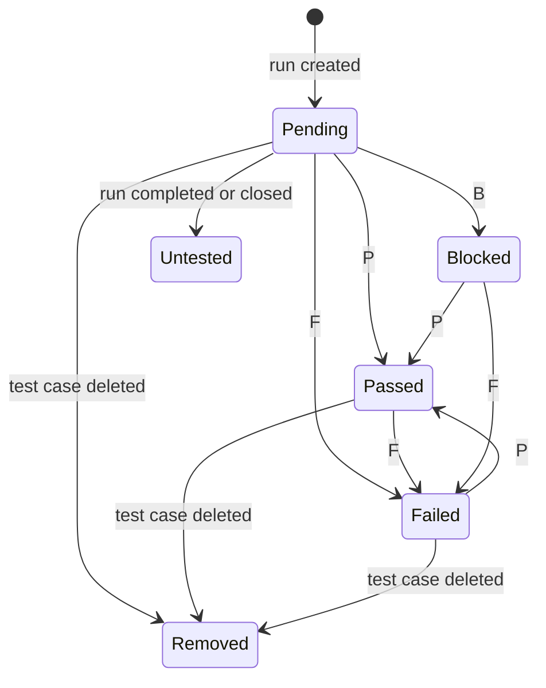
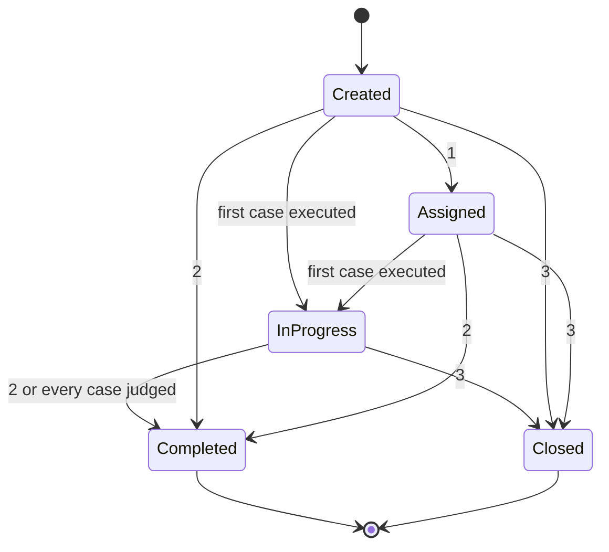

# Testin — Business Requirement Specification

> Testin is test case management that lives inside the IDE instead of inside a
> browser tab. A tester can execute a whole run without touching the mouse — that
> is the product, not a feature of it.

**Draft 1** · Written against `main` at commit `0becc8b2`, 29 August 2026.

Every rule in the main body was true of the product on that commit. Where a rule
is genuinely undecided it is listed as undecided rather than invented.

---

> ### ⚠️ The state of this draft
>
> Moved here from Notion on 6 September 2026, unchanged. **It has not been
> re-checked against the product since it was written**, and `main` has moved
> **127 commits** — 208 files, 8,974 insertions, 2,100 deletions.
>
> What is known to have changed, and is therefore not reflected below:
>
> - **Light mode does not appear in this document at all.** It was built after
>   this draft — 29 commits — and is a whole execution capability: a standalone
>   always-on-top window showing one case at a time, with `P`, `F` and `B` on it.
>   Section 6.2 is incomplete without it. See
>   [the design document](../design/light-mode.md).
> - **#74 is closed.** Section 8 names the grid view's missing keyboard path as a
>   live gap tracked by it. That needs re-checking.
> - **#68 is closed.** `Q-02` cites it as open.
> - **#71 is closed.** `Q-03` cites it as open.
>
> Nothing above has been corrected in the text below, deliberately: this is
> Draft 1 as written, and correcting it is [#72](https://github.com/mtb550/test-in/issues/72).
> The document's own rule is that a rule which quietly stops being true is worse
> than no rule — so the staleness is stated instead of patched over.
>
> **Two databases are not fully moved.** Section 7 has 21 of its 33 business
> rules and none of their `BR-nn` numbers; section 6.4, the use cases, has none of
> its rows. Both were Notion databases, which a copy of the page does not carry.

---

## 1. Purpose and scope

Testin is test case management that lives inside the IDE instead of inside a
browser tab.

This document states what the product **promises**: who uses it, what they work
with, what they can do, and the rules that govern all of it.

**In scope** — actors, the things they work with, the capabilities they can
trigger, the numbered rules, every status and its transitions, and the
expectations that are already promises.

**Out of scope** — how any of it is built. Class names, packages and architecture
are deliberately absent: a reader does not need them, and they date the document
the first time the code is refactored. This document should survive a rewrite of
the product.

---

## 2. The premise: the keyboard is the product

> This is the section to read if only one section is read.

Testin's competitors — Jira, Azure DevOps, TestRail — are web applications. That
is not an implementation detail; it is a ceiling on how fast anyone can work in
them.

| | A browser-based tool | Testin |
|---|---|---|
| **Who owns the keyboard** | The browser. `Ctrl+N`, `Ctrl+W`, `Ctrl+T`, `F5`, `F6` and `F12` are already taken, and what is left works only while no text field has focus | The IDE, which hands its key map to the plugin |
| **Cost of a state change** | A network round trip: click the dropdown, wait, click the option, wait for the save | A local write, immediately |
| **Whether work composes** | It does not — there is no keyboard path to a verdict, so eight rows cannot be judged in one gesture | Selection plus one key, on any number of rows |

So a tester executing a two hundred case run in a browser tool does it with the
mouse, one case at a time, and the tool's speed is bounded by the browser it is
trapped in.

**A tester using Testin can execute a whole run without touching the mouse:** move
to the case, read it, press one key for the verdict, move on. Every other
capability — the tree, the grid, the reports, the Git integration — is a reason to
be in Testin. The keyboard is the reason the work is faster once you are.

That premise is stated here as a capability with rules behind it, **BR-40** to
**BR-44**, rather than left as an emergent property of whichever bindings happen
to exist.

**62 keys are bound**, counted against the product at `0becc8b2`: 40 shared across
surfaces so the same gesture means the same thing everywhere, and 22 belonging to
a single capability. Standard text editing inside dialogs is restored on top of
those and is not counted — that is the platform's behaviour, not Testin's.

---

## 3. Actors

> **There is exactly one actor today: the Tester.**

The product stores a tester's **name** and a tester's **role**. The name is real:
it is stamped on every verdict and on every record the tester touches, so a run
always says who judged it. **The role is read by nothing at all today** — it is
typed into the settings page, written to disk, and never used again. The HTML
report once printed it above the footer; that line was removed and nothing
replaced it.

It is **reserved rather than abandoned**: a planned feature will read it to decide
who may approve a test case and who may remove a test project. Until that ships,
no permission depends on either field, nothing is assigned by them, and no
capability is withheld because of them — so describing a "Lead" as an actor today
would be describing behaviour that does not exist. See **Appendix A** and **Q-04**.

Planned actors are in **Appendix A**, kept separate so the main body stays
checkable against the product.

> ℹ️ The use case diagram (`testin-use-cases.png`) has not been moved. It was an
> image in the Notion page and did not come across with the text.

---

## 4. The things a tester works with

Testin stores everything as files in a folder the tester chooses. The structure is
a tree, and the tree is the product's vocabulary.

```
Test Project
├── Test Cases                (fixed container)
│   ├── Test Set Package      (foldable, nestable)
│   └── Test Set
│       └── Test Case
└── Test Runs                 (fixed container)
    ├── Test Run Package      (foldable, nestable)
    └── Test Run
        └── Test Run Result   (one per case the run holds)
```

| Thing | What it is | Notes |
|---|---|---|
| **Test Project** | The top of one tree, and one folder on disk | Carries a status. Removing it removes everything beneath it |
| **Test Cases** | The fixed container for everything testable | Cannot be created, renamed, moved or removed |
| **Test Runs** | The fixed container for every execution record | Cannot be created, renamed, moved or removed |
| **Test Set Package** | A folder grouping test sets, nestable | Carries a status |
| **Test Set** | A named group of test cases; the unit a run is configured from | Carries a status |
| **Test Case** | One testable thing: description, preconditions, steps, expected result, test data, module, group, priority | The only leaf a tester authors |
| **Test Run Package** | A folder grouping runs, nestable | Carries a status |
| **Test Run** | One execution of a chosen set of cases at a point in time | Carries a status. Holds one result per case |
| **Test Run Result** | What happened to one case in one run: verdict, who recorded it, when, how long it took, and the failure detail if it failed | Belongs to the run, not to the case |

> **The distinction that matters most.** A test case is the *question*; a test run
> result is one *answer*, at one moment, by one person. A case can be in many runs
> and carry a different result in each. This is why deleting a case does not erase
> history — see **BR-11**.

---

## 5. Statuses and transitions

Seven independent status dimensions, **26 constants** in total. They are
independent on purpose: a run's lifecycle is a different question from a case's
verdict, which is a different question again from what the team thinks of the case
itself.

> ❗ Issue [#72](https://github.com/mtb550/test-in/issues/72) counts 22 constants
> across 6 dimensions. Measured against the product, **it is 26 across 7**. Two
> corrections: "Removed" moved from the project dimension to the test-case verdict
> dimension, because a project has no removed state — removing one deletes it —
> while a case deleted out from under a run leaves a row the run still owns; and a
> **seventh dimension was missed entirely** — a test case carries its own status,
> separate from any verdict. It is section 5.7, and it is the one worth reading.

### 5.1 Test case verdict, within one run — 6 constants

| Verdict | Meaning | Who sets it | Key |
|---|---|---|---|
| **Pending** | Queued: this run holds the case and has not reached it | The run, when it is created | — |
| **Passed** | The case behaved as expected | Tester | `P` |
| **Failed** | The case did not; failure detail is collected in the same gesture | Tester | `F` |
| **Blocked** | The case could not be judged — something outside it prevented the test | Tester | `B` |
| **Untested** | The run ended without ever reaching this case | The run, on completion or closure | — |
| **Removed** | The test case itself has been deleted; the row is history | The run, when it notices | — |

**Three verdicts are a tester's to give, and exactly those three carry a key.** The
other three are the run's record of its own state and have no key on purpose —
there is nothing for a person to apply.



### 5.2 Test run lifecycle — 5 constants

| Status | Meaning | Key | Terminal |
|---|---|---|---|
| **Created** | Configured, never started | — | no |
| **In Progress** | At least one case has been executed | — | no |
| **Assigned** | Handed to someone to execute | `1` | no |
| **Completed** | Finished and signed off | `2` | **yes** |
| **Closed** | Ended without being finished | `3` | **yes** |

Created and In Progress carry no key because the product sets them itself: a run is
Created when it is made, and moves to In Progress the moment anything in it is
executed, however it was started.

**A terminal run records nothing further.** Its verdicts are history: execution
cannot be started on it, and any result arriving from elsewhere is refused.



> **⚠️ Undecided — see section 9.** The diagram shows what the product *allows*, and
> it currently allows every move, including Completed back to In Progress.
> **Nothing enforces the run lifecycle at all.** Whether a terminal run may be
> reopened is question **Q-01**.

### 5.3 Live execution state — 4 constants

Not persisted. This is what a card shows while tests are actually running: *idle*,
*running*, *passed*, *failed*. It lives only as long as the IDE session; the run's
own record is the durable one.

### 5.4 Test project — 3 constants

**Active**, **Inactive**, **Archived**. There is no removed state, because removing
a test project deletes it.

### 5.5 Test set — 2 constants

**Active** and **Deprecated**. Deprecated is not deleted — see **BR-12**.

### 5.6 Package — 2 constants

**Active** and **Archived**. Shared by test set packages and test run packages,
because it means the same thing in both — see **BR-13**.

### 5.7 A test case's own status — 4 constants

Separate from the verdict, and easy to confuse with it. A **verdict** says what
happened to the case in one run. **This** says what the team thinks of the case
itself, across every run it is ever in.

| Status | What it means |
|---|---|
| **Pending** | The default. Authored, and nobody has said whether it is any good |
| **Reviewed** | Someone has checked the case is correct |
| **Disabled** | The case exists but is not to be used |
| **To Be Updated** | The case is known to be out of date |

> **⚠️ Nothing in the product uses this today.** It can be set in exactly one place —
> by switching on the **Status** column in the grid view, which is hidden by
> default, and typing the label — and there is no menu entry and no key for it. It
> is written into an export and **not read back by an import**, so a case exported
> as Reviewed comes back Pending. No filter, badge, report, count or rule reads it,
> and no capability is withheld because of it.
>
> That matters because **Reviewed is the "approved" state the planned role
> permissions describe.** The state already exists on every test case. What does
> not exist is who may set it, and anything at all that changes once it is set. See
> **Q-05**.

---

## 6. Capabilities

Every capability below is reachable from the project tree's context menu, an editor
toolbar, or a key. **A capability with no key says so, and says why.**

### 6.1 Authoring

| Capability | Key | Notes |
|---|---|---|
| Create a node — project, package, set, case | `Ctrl+M` | The dialog offers only what is legal in the selected place |
| Open the selected node | `Enter` | |
| Rename | `F2` | |
| Rename, carrying the automation code with it | `Shift+F6` | Renames the generated method too, so the case stays runnable |
| Reorder within the parent | — | Drag, or the menu. Order carries meaning: it is the execution order |
| Copy / Cut / Paste a node | `Ctrl+C` `Ctrl+X` `Ctrl+V` | |
| Copy / Cut / Paste a test case | `Ctrl+Shift+C` `Ctrl+Shift+X` `Ctrl+Shift+V` | Separate keys because the tree and the case list are different targets |
| Undo / Redo the last tree change | `Ctrl+Z` / `Ctrl+Y` | |
| Delete | `Delete` | Refused on the two fixed containers |
| Edit one field of a case directly | `D` `E` `M` `T` `B` `S` `P` `G` | Description, expected result, module, test data, preconditions, steps, priority, group |
| Bulk edit in a grid | — | The grid takes Excel gestures: `Ctrl+C`, `Ctrl+X`, `Ctrl+V` |
| Search | `Ctrl+F` | |

### 6.2 Execution — the flow the product exists for

| Capability | Key | Notes |
|---|---|---|
| Start execution | — | Toolbar. Begins at the first case the run has not reached |
| Run the selected cases through the automation | `F5` | |
| Run everything a node holds | — | Context menu, on a test set or a test run |
| Stop | — | Toolbar. Puts every case it started back |
| **Record Passed** | **`P`** | |
| **Record Failed** | **`F`** | Opens the failure detail dialog in the same gesture |
| **Record Blocked** | **`B`** | |
| Move to the next / previous case | `Ctrl+→` / `Ctrl+←` | |
| Set the run's status | `1` `2` `3` | Assigned, Completed, Closed |
| Jump to the generated automation method | `Shift+F5` | |
| Generate the automation method | `Ctrl+F12` | |

> **ℹ️ Light mode is missing from this table.** It was built after this draft: a
> standalone always-on-top window showing one case at a time, so a tester can work
> with the IDE minimized and still record a verdict — `P`, `F`, `B`, `Ctrl+D` for
> the rest of the case, `Escape` to close. It is the purest expression of section
> 2's premise and it is not described here. See
> [the design document](../design/light-mode.md).

### 6.3 Evidence and exchange

| Capability | Key | Formats |
|---|---|---|
| Generate a report | `Ctrl+P` | HTML, PDF, Word, Excel |
| Export | — | CSV, Excel, HTML, JSON |
| Import | — | CSV, Excel, JSON |
| Show node details | — | Counts for a container, a verdict breakdown for a run |
| Synchronise with Git | — | Requires the Git plugin |
| Synchronise over SFTP | — | Credentials live in the IDE's password store, never in a file |

### 6.4 Use cases

> **❗ Not moved yet.** This was a Notion database — one row per capability a tester
> triggers, each in the usual form (actor, precondition, main flow, alternatives,
> postcondition) and each naming the key that starts it, numbered `UC-nn`.
>
> **Mouse needed** is the column to scan: anything in the execution flow that is
> not **No** is a breach of **BR-40**, not a detail.

---

## 7. Business rules

Numbered so an issue or a commit can cite one.

> **❗ Partially moved: 21 of 33 rules, and without their numbers.** This was a
> Notion database; the text of 21 rules came across and the `BR-nn` column did
> not. The numbers are the point of the database — an issue cannot cite a rule
> that has none — so they are left blank rather than invented.
>
> Twelve rules are missing entirely, among them the two the text above cites by
> number: **BR-12** (a deprecated test set is not deleted) and **BR-13** (Active
> and Archived mean the same thing for both kinds of package).
>
> **Known breaches were stated rather than hidden.** Two rules were broken by the
> product at `0becc8b2`, each cited to the issue that tracks it. Those citations
> are also not in what arrived.

### Data and storage

| BR | Rule |
|---|---|
| — | All data is files on the tester's own disk, in a folder they chose. |
| — | A test project is one folder. Everything belonging to it lives beneath that folder and nowhere else. |
| — | What is stored is byte-identical to what the tester typed. Displaying a value may reformat it; saving never does. |
| — | Secrets are never written to a file the repository carries. They are held in the IDE's own password store. |

### Structure

| BR | Rule |
|---|---|
| — | A node may only be moved into a place that can legally hold it. A test set cannot be dropped among runs, and a run cannot be dropped inside another run. |
| — | Test Cases and Test Runs are fixed containers. They cannot be created, renamed, moved or removed. |

### Runs and history

| BR | Rule |
|---|---|
| — | A test run is a record of an execution at a point in time, not a live view of the test set. Changing a case after a run has judged it does not change what the run recorded. |
| — | A result is written into the run the tester started, and no other. The same case running in another run does not affect this one. |
| — | A test case may belong to any number of runs and carry a different verdict in each. The verdict belongs to the run. |
| — | Every verdict records who gave it and when, whether a person typed it or the automation reported it. |
| — | A signed-off run records nothing further. Once Completed or Closed, execution cannot be started on it and no result arriving from anywhere is written into it. |

### Verdicts

| BR | Rule |
|---|---|
| — | A tester may record exactly three verdicts: Passed, Failed, Blocked. |
| — | Pending and Untested are the run's own record and cannot be applied by a person. Pending means not reached yet; Untested means never reached, and never will be. |

### Feedback

| BR | Rule |
|---|---|
| — | Every state-changing action confirms itself once, in the past tense, and a bulk action confirms once with a count — never once per item. |

### The keyboard

| BR | Rule |
|---|---|
| — | A published binding is a promise. Changing one costs every tester their muscle memory, so a binding changes only deliberately and visibly. |
| — | A key is shown wherever the capability it triggers is shown, so it can be learned by using the menu once. |
| — | A capability with no key says so rather than being silently unreachable. |
| — | One key means one thing. The same keystroke does not do different jobs in different places. |

### Degradation

| BR | Rule |
|---|---|
| — | Testin installs and runs in any JetBrains IDE. Where an optional plugin is absent, the capabilities that need it are withheld and the reason is stated — never a failure. |
| — | Java absent: no automation code is generated and no navigation to it. Everything else works. |
| — | Git absent: no synchronisation or cloning. The data is still on disk and still usable. |

---

## 8. Non-functional expectations

These are already promises, not aspirations.

| Expectation | What it means |
|---|---|
| **Data stays local** | Everything is files under a folder the tester chose. Nothing is uploaded |
| **Zero telemetry** | The product makes no network calls of its own. The only traffic that exists is the tester's own Git or SFTP synchronisation, which they configure and trigger |
| **Fidelity** | Stored data is byte-identical to what was typed — **BR-31** |
| **Graceful degradation** | A missing optional plugin removes capability and states why. It never produces an error — **BR-50** |
| **Keyboard completeness** | A full execution cycle is completable from the keyboard alone. **True of the list view; the grid view was a gap tracked as #74 — which is now closed, so this needs re-checking** |
| **Cross-IDE** | Runs in IntelliJ IDEA, PyCharm, GoLand, WebStorm and the rest of the family |

---

## 9. Undecided

Listed rather than guessed. Each is a real question the product has not answered.

| | Question | Why it is open |
|---|---|---|
| **Q-01** | May a Completed or Closed run be reopened? | **Nothing enforces the run lifecycle at all today** — any status can be set from any other. Section 5.2 describes what is *allowed*, which is everything. The transition table that once declared a lifecycle was deleted and never replaced. Tracked in [#10](https://github.com/mtb550/test-in/issues/10) |
| **Q-02** | Is a deprecated test set hidden, or merely not offered? | Today it is shown, greyed, and not offered. Whether it should disappear from the tree entirely is not settled. Tracked in [#68](https://github.com/mtb550/test-in/issues/68) — **now closed; re-check** |
| **Q-03** | What happens to a run when the test set behind it is deleted wholesale? | The per-case answer is **BR-11**. The whole-set answer has never been stated. Tracked in [#71](https://github.com/mtb550/test-in/issues/71) — **now closed; re-check** |
| **Q-04** | What are the roles, and what does each one permit? | The field is reserved, not dead: role-based permissions are planned, and will read it to decide **who may approve a test case** and **who may remove a test project**. What is undecided is the list of roles and the permission each carries — and free text cannot answer "may this person approve", so the field will need a fixed set behind it. It is also application-level today, meaning one role per IDE installation rather than one per team member. Tracked in [#14](https://github.com/mtb550/test-in/issues/14) |
| **Q-05** | What does a test case's own status do? | Four states exist on every test case — Pending, Reviewed, Disabled, To Be Updated — and **not one of them changes anything**. A Disabled case is still offered to a run; a To Be Updated case is still executed; a Reviewed case is treated exactly like an unreviewed one. The state is settable only in a hidden grid column, and an import drops it. Deciding what each state *does* is the same decision as **Q-04**: Reviewed is approval, and approval means nothing until something is withheld from an unapproved case |

---

## Appendix A — Planned actors

> **⚠️ Nothing in this appendix exists.** It is kept separate so the main body stays
> true and checkable against the product.

| Planned actor | What they would do | Tracked in |
|---|---|---|
| **Lead** | Assign a run to a tester and watch its progress without executing it | [#14](https://github.com/mtb550/test-in/issues/14) |
| **Lead** | Be notified when a run completes or a case fails, without opening the IDE | [#15](https://github.com/mtb550/test-in/issues/15), [#159](https://github.com/mtb550/test-in/issues/159) |
| **Any role** | Gate capabilities by role: who may approve a test case, and who may remove a test project. This is what the stored `Tester role` is reserved for — it is the reason the field stays on the settings page while nothing reads it | [#14](https://github.com/mtb550/test-in/issues/14) |

---

## Appendix B — Glossary

| Term | Definition |
|---|---|
| **Test Project** | The top of one tree; one folder holding everything below it |
| **Test Set** | A named group of test cases; what a run is configured from |
| **Test Case** | One testable thing, with its steps and expected result. The question |
| **Test Run** | One execution of a chosen set of cases at a point in time |
| **Test Run Result** | What happened to one case in one run. The answer |
| **Verdict** | Passed, Failed or Blocked — the three a tester can give |
| **Pending** | This run holds the case and has not reached it yet |
| **Untested** | The run ended without ever reaching the case |
| **Removed** | The test case has been deleted; the run keeps what it recorded |
| **Terminal** | Completed or Closed. A terminal run records nothing further |
| **Deprecated** | A test set kept for its history but no longer offered for new runs |
| **Archived** | A package kept but moved out of the way |
| **Automation** | The generated test method that executes a case without a person |

---

> **How to keep this true.** Every rule above is checkable against the product.
> When behaviour changes, change the rule in the same breath and cite its number in
> the commit. A rule that quietly stops being true is worse than no rule, because
> someone will plan against it.
