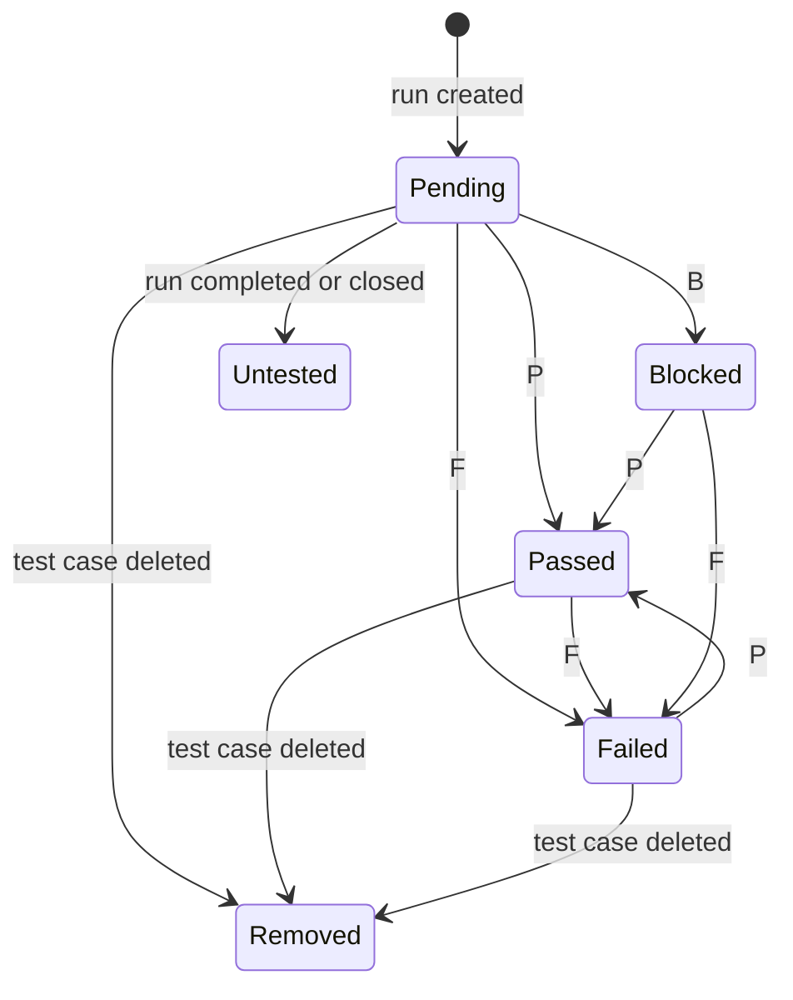
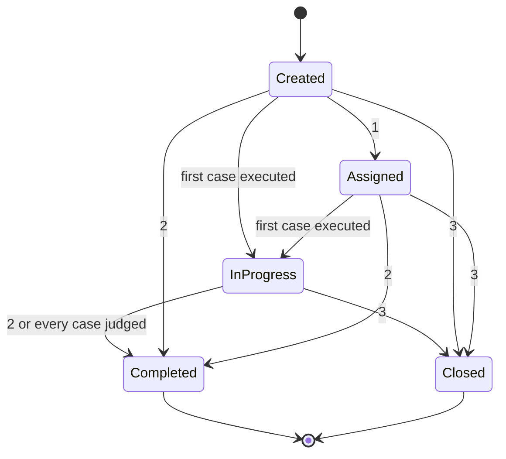

[Documentation](../README.md) › [Business requirements](business-requirements.md) › The product

# The product — business requirements

> Testin is test case management that lives inside the IDE instead of inside a
> browser tab. A tester can execute a whole test run without touching the
> mouse. That is the product, not a feature of it.

| | |
|---|---|
| **Area** | [Business requirements](business-requirements.md) |
| **Part of Testin** | All of it. These rules hold everywhere. Each part also has a document of its own, listed in [the index](business-requirements.md) |
| **Numbering** | Its rules carry no letters, only a number, as in `BR-11`. Letters say which part of Testin a rule belongs to, and these rules belong to all of it |
| **Answers** | Who uses Testin, what they work with, every status, the rules for the whole product, and what is undecided |
| **State** | **Draft 1** — moved from Notion, not re-checked. Correcting it is [#72](https://github.com/mtb550/test-in/issues/72) |
| **Checked against** | `main` at `0becc8b2`, 29 August 2026 |
| **Written to** | Written before [the standard](../standard.md). It names keys and has no user stories. [#72](https://github.com/mtb550/test-in/issues/72) brings it in line |

Every rule in the main body was true of the product on that commit. Where a rule
is genuinely undecided it is listed as undecided rather than invented.

---

> ### ⚠️ The state of this draft
>
> Moved here from Notion on 6 September 2026. Its facts are unchanged. Only the
> wording was made plain, to [the standard](../standard.md). **It has not been
> re-checked against the product since it was written.** `main` has moved
> **127 commits**: 208 files, 8,974 insertions, 2,100 deletions.
>
> What is known to have changed, and is therefore not reflected below:
>
> - **Light mode does not appear in this document at all.** It was built after
>   this draft, 29 commits later. It is a whole execution capability. It is a
>   standalone always-on-top window, showing one test case at a time, with `P`,
>   `F` and `B` on it.
>   Section 6.2 is incomplete without it. See
>   [the design document](../design/light-mode.md).
> - **#74 is closed.** Section 8 names the grid view's missing keyboard path as a
>   live gap tracked by it. That needs re-checking.
> - **#68 is closed.** `Q-02` cites it as open.
> - **#71 is closed.** `Q-03` cites it as open.
>
> Nothing above has been corrected in the text below, deliberately: this is
> Draft 1 as written, and correcting it is [#72](https://github.com/mtb550/test-in/issues/72).
> The document's own rule is that a rule which quietly stops being true is worse
> than no rule. So the staleness is stated, instead of patched over.
>
> **Two databases are not fully moved.** Section 7 has 21 of its 33 business
> rules, and none of their `BR-nn` numbers. Section 6.4, the use cases, has none
> of its rows. Both were Notion databases, and a copy of the page does not carry
> those.

---

## 1. Purpose and scope

Testin is test case management that lives inside the IDE instead of inside a
browser tab.

This document states what the product **promises**. It says who uses Testin,
what they work with, what they can do, and the rules that govern all of it.

**In scope:**

- the actors
- the things they work with
- the capabilities they can trigger
- the numbered rules
- every status, and its transitions
- the expectations that are already promises

**Out of scope: how any of it is built.** Class names, packages and
architecture are deliberately absent. A reader does not need them, and they
date the document the first time the code is refactored. This document should
survive a rewrite of the product.

---

## 2. The idea: the keyboard is the product

> This is the section to read if only one section is read.

Testin's competitors are web applications: Jira, Azure DevOps and TestRail.
That is not a small detail of how they are built. It is a limit on how fast
anyone can work in them.

| | A browser-based tool | Testin |
|---|---|---|
| **Who owns the keyboard** | The browser. `Ctrl+N`, `Ctrl+W`, `Ctrl+T`, `F5`, `F6` and `F12` are already taken, and what is left works only while no text field has focus | The IDE, which hands its key map to the plugin |
| **What one change costs** | A trip to the server. Click the dropdown, wait, click the option, wait for the save | A write on this machine, straight away |
| **Whether work stacks up** | It does not. There is no way to reach a verdict from the keyboard, so eight rows cannot be judged in one go | Select the rows, press one key. Any number of rows |

So a tester executing a 200 test case run in a browser tool does it with the
mouse, one test case at a time. The tool can never be faster than the browser
it is trapped in.

**A tester using Testin can execute a whole test run without touching the
mouse.** Move to the test case, read it, press one key for the verdict, move
on. Every other capability is a reason to be in Testin: the tree, the grid, the
reports, the Git integration. The keyboard is the reason the work is faster
once the tester is there.

That idea is written down here as a capability, with rules behind it, **BR-40**
to **BR-44**. It is not left to fall out of whichever keys happen to be bound.

**62 keys are bound**, counted against the product at `0becc8b2`. Of those, 40
are shared across screens, so the same gesture means the same thing
everywhere. The other 22 belong to a single capability. Standard text editing
inside dialogs is restored on top of those, and is not counted. That is the
platform's behavior, not Testin's.

---

## 3. Actors

> **There is exactly one actor today: the Tester.**

The product stores a tester's **name** and a tester's **role**. The name is
real. It is stamped on every verdict, and on every record the tester touches,
so a test run always says who judged it. **The role is read by nothing at all
today.** It is typed into the settings page, written to disk, and never used
again. The HTML report once printed it above the footer. That line was removed,
and nothing replaced it.

It is **reserved rather than abandoned**. A planned feature will read it to
decide who may approve a test case, and who may remove a test project. Until
that ships, three things are true. No permission depends on either field.
Nothing is assigned by them. No capability is withheld because of them. So
describing a "Lead" as an actor today would describe behavior that does not
exist. See **Appendix A** and **Q-04**.

Planned actors are in **Appendix A**, kept separate so the main body stays
checkable against the product.

> ℹ️ The use case diagram (`testin-use-cases.png`) has not been moved. It was an
> image in the Notion page and did not come across with the text.

---

## 4. The things a tester works with

Testin stores everything as files in a folder the tester chooses. The structure is
a tree, and the tree is the product's vocabulary.

```
Test Project
├── Test Cases                (fixed container)
│   ├── Test Set Package      (foldable, nestable)
│   └── Test Set
│       └── Test Case
└── Test Runs                 (fixed container)
    ├── Test Run Package      (foldable, nestable)
    └── Test Run
        └── Test Run Result   (one per case the run holds)
```

| Thing | What it is | Notes |
|---|---|---|
| **Test Project** | The top of one tree, and one folder on disk | Carries a status. Removing it removes everything beneath it |
| **Test Cases** | The fixed container for everything testable | Cannot be created, renamed, moved or removed |
| **Test Runs** | The fixed container for every execution record | Cannot be created, renamed, moved or removed |
| **Test Set Package** | A folder grouping test sets, nestable | Carries a status |
| **Test Set** | A named group of test cases. A test run is built from one | Carries a status |
| **Test Case** | One thing to test: description, preconditions, steps, expected result, test data, module, group, priority | The only thing in the tree a tester writes |
| **Test Run Package** | A folder grouping runs, nestable | Carries a status |
| **Test Run** | One pass through a chosen set of test cases, at one moment | Carries a status. Holds one result per test case |
| **Test Run Result** | What happened to one case in one run: verdict, who recorded it, when, how long it took, and the failure detail if it failed | Belongs to the run, not to the case |

> **The difference that matters most.** A test case is the *question*. A test
> run result is one *answer*, at one moment, by one person. A test case can be
> in many test runs, and carry a different result in each. This is why deleting a test case does
> not erase history. See **BR-11**.

---

## 5. Statuses and transitions

There are seven kinds of status, and **26 values** in all. The seven do not
affect each other, and that is on purpose. Where a test run has got to is one
question. The verdict a test case got is another. What the team thinks of the
test case itself is a third.

> ❗ Issue [#72](https://github.com/mtb550/test-in/issues/72) counts 22 values
> across 6 kinds of status. Measured against the product, **it is 26 across
> 7**. Two corrections. First, "Removed" moved. It used to sit with a test
> project's status, and it belongs with the verdict a test case gets. A test
> project has no removed state, because removing one deletes it. A test case
> deleted out from under a test run leaves a row the test run still owns.
> Second, a **seventh kind of status was missed entirely**. A test case carries
> its own status, separate from any verdict. It is section 5.7, and it is the
> one worth reading.

### 5.1 The verdict a test case gets in one test run — six values

| Verdict | Meaning | Who sets it | Key |
|---|---|---|---|
| **Pending** | Waiting. This test run holds the test case and has not reached it | The test run, when it is created | — |
| **Passed** | The test case behaved as expected | Tester | `P` |
| **Failed** | It did not. The failure detail is collected in the same gesture | Tester | `F` |
| **Blocked** | The test case could not be judged. Something outside it prevented the test | Tester | `B` |
| **Untested** | The test run ended without ever reaching this test case | The test run, when it ends | — |
| **Removed** | The test case itself has been deleted. The row is history now | The test run, when it notices | — |

**Three verdicts are a tester's to give, and exactly those three carry a key.**
The other three are the test run's record of its own state. They have no key on
purpose, because there is nothing for a person to apply.



### 5.2 Where a test run has got to — five values

| Status | Meaning | Key | Signed off |
|---|---|---|---|
| **Created** | Set up, never started | — | no |
| **In Progress** | At least one test case has been run | — | no |
| **Assigned** | Handed to someone to run | `1` | no |
| **Completed** | Finished and signed off | `2` | **yes** |
| **Closed** | Ended without being finished | `3` | **yes** |

Created and In Progress carry no key, because the product sets them itself. A
test run is Created when it is made. It moves to In Progress the moment
anything in it is executed, however it was started.

**A signed-off test run records nothing further.** Its verdicts are history.
It cannot be started, and any result arriving from anywhere else is refused.



> **⚠️ Undecided. See section 9.** The diagram shows what the product *allows*.
> It currently allows every move, including Completed back to In Progress.
> **Nothing stops a test run moving anywhere at all.** Whether a signed-off test
> run may be reopened is question **Q-01**.

### 5.3 What a card shows while tests are running — four values

These four are never saved to disk. They are what a card shows while tests are
actually running: *idle*, *running*, *passed*, *failed*. They last only as long
as the IDE is open. The test run's own record is the one that is kept.

### 5.4 A test project's status — three values

**Active**, **Inactive**, **Archived**. There is no removed state, because removing
a test project deletes it.

### 5.5 A test set's status — two values

**Active** and **Deprecated**. Deprecated is not deleted. See **BR-12**.

### 5.6 A package's status — two values

**Active** and **Archived**. Shared by test set packages and test run packages,
because it means the same thing in both. See **BR-13**.

### 5.7 A test case's own status — four values

This is separate from the verdict, and easy to confuse with it. A **verdict**
says what happened to the test case in one test run. **This** says what the
team thinks of the test case itself, across every test run it is ever in.

| Status | What it means |
|---|---|
| **Pending** | The default. Written, and nobody has said whether it is any good |
| **Reviewed** | Someone has checked the case is correct |
| **Disabled** | The case exists but is not to be used |
| **To Be Updated** | The case is known to be out of date |

> **⚠️ Nothing in the product uses this today.** It can be set in exactly one
> place. The tester switches on the **Status** column in the grid view, which is
> hidden by default, and types the label. There is no menu entry, and no key. It
> is written into an export and **not read back by an import**, so a test case
> exported as Reviewed comes back Pending. No filter, badge, report, count or
> rule reads it, and no capability is withheld because of it.
>
> That matters because **Reviewed is the "approved" state the planned role
> permissions describe.** The state already exists on every test case. What does
> not exist is who may set it, and anything at all that changes once it is set. See
> **Q-05**.

---

## 6. Capabilities

Every capability below is reachable from the project tree's context menu, an editor
toolbar, or a key. **A capability with no key says so, and says why.**

### 6.1 Authoring

| Capability | Key | Notes |
|---|---|---|
| Create a node: test project, package, test set or test case | `Ctrl+M` | The dialog offers only what is legal in the selected place |
| Open the selected node | `Enter` | |
| Rename | `F2` | |
| Rename, carrying the automation code with it | `Shift+F6` | Renames the generated method too, so the case stays runnable |
| Reorder within the parent | — | Drag, or the menu. Order carries meaning: it is the execution order |
| Copy / Cut / Paste a node | `Ctrl+C` `Ctrl+X` `Ctrl+V` | |
| Copy / Cut / Paste a test case | `Ctrl+Shift+C` `Ctrl+Shift+X` `Ctrl+Shift+V` | Separate keys because the tree and the case list are different targets |
| Undo / Redo the last tree change | `Ctrl+Z` / `Ctrl+Y` | |
| Delete | `Delete` | Refused on the two fixed containers |
| Edit one field of a case directly | `D` `E` `M` `T` `B` `S` `P` `G` | Description, expected result, module, test data, preconditions, steps, priority, group |
| Bulk edit in a grid | — | The grid takes Excel gestures: `Ctrl+C`, `Ctrl+X`, `Ctrl+V` |
| Search | `Ctrl+F` | |

### 6.2 Execution — the flow the product exists for

| Capability | Key | Notes |
|---|---|---|
| Start execution | — | Toolbar. Begins at the first case the run has not reached |
| Run the selected cases through the automation | `F5` | |
| Run everything a node holds | — | Context menu, on a test set or a test run |
| Stop | — | Toolbar. Puts every case it started back |
| **Record Passed** | **`P`** | |
| **Record Failed** | **`F`** | Opens the failure detail dialog in the same gesture |
| **Record Blocked** | **`B`** | |
| Move to the next / previous case | `Ctrl+→` / `Ctrl+←` | |
| Set the run's status | `1` `2` `3` | Assigned, Completed, Closed |
| Jump to the generated automation method | `Shift+F5` | |
| Generate the automation method | `Ctrl+F12` | |

> **ℹ️ Light mode is missing from this table.** It was built after this draft: a
> standalone always-on-top window showing one case at a time, so a tester can work
> with the IDE minimized and still record a verdict. The keys are `P`, `F` and
> `B`, with `Ctrl+D` for the rest of the test case and `Escape` to close. It is
> the clearest example of section 2's idea, and it is not described here.
> See
> [the design document](../design/light-mode.md).

### 6.3 Evidence and exchange

| Capability | Key | Formats |
|---|---|---|
| Generate a report | `Ctrl+P` | HTML, PDF, Word, Excel |
| Export | — | CSV, Excel, HTML, JSON |
| Import | — | CSV, Excel, JSON |
| Show node details | — | Counts for a container, a verdict breakdown for a run |
| Sync with Git | — | Needs the Git plugin |
| Sync over SFTP | — | Passwords live in the IDE's own password store, never in a file |

### 6.4 Use cases

> **❗ Not moved yet.** This was a Notion database. It held one row per
> capability a tester triggers, numbered `UC-nn`. Each row was in the usual form
> (who does it, what must be true first, the main flow, the alternatives, and
> what is true afterward). Each one named the key that starts it.
>
> **Mouse needed** is the column to scan. Anything in the execution flow that is
> not **No** is a breach of **BR-40**, not a detail.

---

## 7. Business rules

Numbered so an issue or a commit can cite one.

> **❗ Partially moved: 21 of 33 rules, and without their numbers.** This was a
> Notion database. The text of 21 rules came across. The `BR-nn` column did not.
> The numbers are the point of the database, because an issue cannot cite a rule
> that has none. So they are left blank rather than invented.
>
> Twelve rules are missing entirely. Among them are the two the text above cites
> by number. **BR-12** says a deprecated test set is not deleted. **BR-13** says
> Active and Archived mean the same thing for both kinds of package.
>
> **Known breaches were stated, not hidden.** Two rules were broken by the
> product at `0becc8b2`, and each was cited to the issue that tracks it. Those
> citations are also not in what arrived.

### Data and storage

| BR | Rule |
|---|---|
| — | All data is files on the tester's own disk, in a folder they chose. |
| — | A test project is one folder. Everything belonging to it lives beneath that folder and nowhere else. |
| — | What is stored is exactly what the tester typed, character for character. Showing a value on screen may tidy it up. Saving never does. |
| — | Secrets are never written to a file the repository carries. They are held in the IDE's own password store. |

### Structure

| BR | Rule |
|---|---|
| — | A node may only be moved into a place that can legally hold it. A test set cannot be dropped among runs, and a run cannot be dropped inside another run. |
| — | Test Cases and Test Runs are fixed containers. They cannot be created, renamed, moved or removed. |

### Runs and history

| BR | Rule |
|---|---|
| — | A test run is a record of an execution at a point in time, not a live view of the test set. Changing a case after a run has judged it does not change what the run recorded. |
| — | A result is written into the run the tester started, and no other. The same case running in another run does not affect this one. |
| — | A test case may belong to any number of runs and carry a different verdict in each. The verdict belongs to the run. |
| — | Every verdict records who gave it and when, whether a person typed it or the automation reported it. |
| — | A signed-off run records nothing further. Once Completed or Closed, execution cannot be started on it and no result arriving from anywhere is written into it. |

### Verdicts

| BR | Rule |
|---|---|
| — | A tester may record exactly three verdicts: Passed, Failed, Blocked. |
| — | Pending and Untested are the test run's own record, and a person cannot apply them. Pending means not reached yet. Untested means never reached, and never will be. |

### Feedback

| BR | Rule |
|---|---|
| — | Every action that changes something confirms itself once, in the past tense. An action on several things confirms once, with a count, never once per thing. |

### The keyboard

| BR | Rule |
|---|---|
| — | A published binding is a promise. Changing one costs every tester their muscle memory, so a binding changes only deliberately and visibly. |
| — | A key is shown wherever the capability it triggers is shown, so it can be learned by using the menu once. |
| — | A capability with no key says so rather than being silently unreachable. |
| — | One key means one thing. The same keystroke does not do different jobs in different places. |

### When a plugin is missing

| BR | Rule |
|---|---|
| — | Testin installs and runs in any JetBrains IDE. Where an optional plugin is missing, the features that need it are withheld, and Testin says why. It never fails. |
| — | Without Java: no automation code is written, and no jumping to it. Everything else works. |
| — | Without Git: no sync and no cloning. The data is still on disk, and still usable. |

---

## 8. Promises about the product as a whole

These are promises already kept, not hopes.

| Promise | What it means |
|---|---|
| **The data stays on your machine** | Everything is files under a folder the tester chose. Nothing is uploaded |
| **Nothing is sent anywhere** | Testin makes no network calls of its own. The only traffic is the tester's own Git or SFTP sync, which they set up and start |
| **What you typed is what is stored** | Stored data matches what was typed, character for character — **BR-31** |
| **A missing plugin removes a feature, not the product** | Testin withholds the feature and says why. It never shows an error — **BR-50** |
| **The keyboard is enough** | A tester can run a whole test run without the mouse. **True of the list view. The grid view was a gap, tracked as #74, which is now closed, so this needs re-checking** |
| **It runs in every JetBrains IDE** | IntelliJ IDEA, PyCharm, GoLand, WebStorm and the rest of the family |

---

## 9. Undecided

Listed rather than guessed. Each is a real question the product has not answered.

| | Question | Why it is open |
|---|---|---|
| **Q-01** | May a Completed or Closed test run be reopened? | **Nothing stops a test run moving anywhere at all today.** Any status can be set from any other. Section 5.2 describes what is *allowed*, which is everything. The table that once said which moves were legal was deleted, and never replaced. Tracked in [#10](https://github.com/mtb550/test-in/issues/10) |
| **Q-02** | Is a deprecated test set hidden, or just not offered? | Today it is shown, drawn gray, and not offered. Whether it should disappear from the tree entirely is not settled. Tracked in [#68](https://github.com/mtb550/test-in/issues/68), **now closed, so re-check** |
| **Q-03** | What happens to a test run when the whole test set behind it is deleted? | The answer for one test case is **BR-11**. The answer for a whole test set has never been stated. Tracked in [#71](https://github.com/mtb550/test-in/issues/71), **now closed, so re-check** |
| **Q-04** | What are the roles, and what does each one permit? | The field is reserved, not dead: role-based permissions are planned, and will read it to decide **who may approve a test case** and **who may remove a test project**. What is undecided is the list of roles and the permission each carries — and free text cannot answer "may this person approve", so the field will need a fixed set behind it. It is also application-level today, meaning one role per IDE installation rather than one per team member. Tracked in [#14](https://github.com/mtb550/test-in/issues/14) |
| **Q-05** | What does a test case's own status do? | Every test case has four states: Pending, Reviewed, Disabled and To Be Updated. **Not one of them changes anything.** A Disabled test case is still offered to a test run. A To Be Updated test case is still run. A Reviewed test case is treated exactly like an unreviewed one. The state can be set only in a hidden grid column, and an import drops it. Deciding what each state *does* is the same decision as **Q-04**. Reviewed means approved, and approval means nothing until something is withheld from a test case that is not approved |

---

## Appendix A — Planned actors

> **⚠️ Nothing in this appendix exists.** It is kept separate so the main body stays
> true and checkable against the product.

| Planned actor | What they would do | Tracked in |
|---|---|---|
| **Lead** | Assign a run to a tester and watch its progress without executing it | [#14](https://github.com/mtb550/test-in/issues/14) |
| **Lead** | Be notified when a run completes or a case fails, without opening the IDE | [#15](https://github.com/mtb550/test-in/issues/15), [#159](https://github.com/mtb550/test-in/issues/159) |
| **Any role** | Gate capabilities by role: who may approve a test case, and who may remove a test project. This is what the stored `Tester role` is reserved for — it is the reason the field stays on the settings page while nothing reads it | [#14](https://github.com/mtb550/test-in/issues/14) |

---

## Appendix B — Glossary

| Term | Definition |
|---|---|
| **Test Project** | The top of one tree. One folder, holding everything below it |
| **Test Set** | A named group of test cases. A test run is built from one |
| **Test Case** | One testable thing, with its steps and expected result. The question |
| **Test Run** | One execution of a chosen set of cases at a point in time |
| **Test Run Result** | What happened to one case in one run. The answer |
| **Verdict** | Passed, Failed or Blocked — the three a tester can give |
| **Pending** | This run holds the case and has not reached it yet |
| **Untested** | The run ended without ever reaching the case |
| **Removed** | The test case has been deleted. The test run keeps what it recorded |
| **Signed off** | Completed or Closed. A signed-off test run records nothing further |
| **Deprecated** | A test set kept for its history but no longer offered for new runs |
| **Archived** | A package kept but moved out of the way |
| **Automation** | The generated test method that executes a case without a person |

---

> **How to keep this true.** Every rule above can be checked against the product.
> When the plugin changes, change the rule in the same breath, and put its number
> in the commit message. A rule that quietly stops being true is worse than no
> rule, because someone will plan against it.

---

[Documentation](../README.md) › [Business requirements](business-requirements.md) › **The product** — each part's own promises: [The project panel](project-panel.md)
